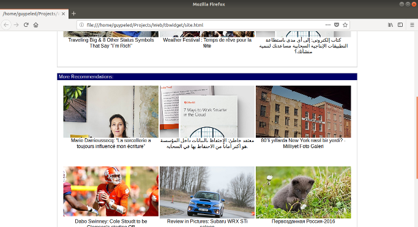
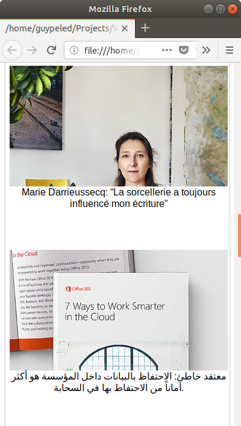

# Taboola widget 

A recommendation widget using the Taboola REST API.

## Design Goals:
1. Hide implementation details and provide simple APIs while allowing customization.
2. Optimize for performance
    - Used build method at end of html to queue widget building as soon as possible.
    - Use minimum interaction with browser`s DOM
        - Utilized getElementByID which is O(1)
        - Used innerHTML to allow browser to build the entire widget with one API call.
3. Allow customization by providing a template function argument to custom render 
   the item HTML.
4. Utilize new features for code maintainability and performance while maintaining 
   backwards compatibility.
   - 74% of modern browsers are evergreen (automatically updated) which means that
     utilizing new browser features is a good practice for most of the users while
     polyfilling and transpiling will work for older browsers.
   - Automatic usage of "right" version might hinder 'CDN' capabilities as it will
     require server side forking and as the code is relatively simple we might do 
     with serving es5 for all browsers or providing different resources and allow sites
     to deicide which resource they want to use. 
5. Account for cross domain communication by using CORS protocol (Cross-Origin 
   Resource Sharing) or by implementing script tag creation communication for older browsers.
6. Allow actions to be executed after widget building or widget loading failure.


## Implementation Details:

1. Implement a class that will encapsulate the internal behaviors.
2. Class should be initialized once with common API parameters to centralize their initialization.
3. Each widget should be registered with minimum code while keeping performance as a priority. 
4. Registering a widget should allow for customizing the item template.
5. Hide JSON structure from the client by hiding internal structure of the data
6. Errors will be logged to the console and through promises returned by the TBWidget.register method.
7. Modern browsers has optimized string concatenation memory allocation while older browsers 
   where more performant using Array.join.  
8. To minimize DOM interaction to provide for high performance the widget will be built entirely as string on the javascript side and then used in one DOM interaction to initialize the innerHTML of the widget container element.
9. Register widget should return a promise to allow actions to be executed 
   after widget building or widget loading failure.

## Usage:

Reference the widget library and create a widget instance passing your publisher id, app type and api key.
```html
<head>
    <link rel="stylesheet" type="text/css" href="site.css">
    <script src="tbwidget.es5.js"></script>
    <script>
        var tbwidget = new TBWidget(
            "taboola-templates",
            "desktop",
            "f9040ab1b9c802857aa783c469d0e0ff7e7366e4"
        );
    </script>
</head>
```

Register a widget instance giving it an element id to populate, item type and amount of items to return.

Using the register return promise you can do stuff after element is populated. 

In the example the element is displayed.
```html
<div id="tbwidget_side" class="tbcontainer">
    <script>
        tbwidget.register("tbwidget_side","video", 6).then(function(){
            tbwidget_side.style.display = "block";
        });
    </script>
</div>
```

You can customize the item rendering by giving your own template.

```html
<div id="tbwidget_container"  class="tbcontainer">
    <script>
        tbwidget.register("tbwidget_container","video", 6, function(item){
            return "<div class='tbitem'>" +
                "<a href='"+item.url+"' target='_blank'>" +
                    "<div class='tbimage' style='background-image:url(\"" + item.thumbnail +"\")'>" +
                        "<span class='tbbranding'>"+item.branding+"</span>" +
                    "</div>" +
                    "<div class='tblabel'>" +
                        item.name +
                    "</div>" +
                    "</div>" +
                "</a>" +
            "</div>"
        }).then(function(){
            tbwidget_container.style.display = "block";
        });
    </script>
</div>
```

For the widgets to be populated you need to call the build function at the end of the html page.

```html
    <script>
        tbwidget.build();
    </script>
</body>
```
## Responsive web design:

The actual widget is agnostic to the form factor of the client and all the changes are handled by the client. In this case there the _site.css_ has a conditional definition to accommodate for different form factors.

The desktop layout:


The mobile layout:

